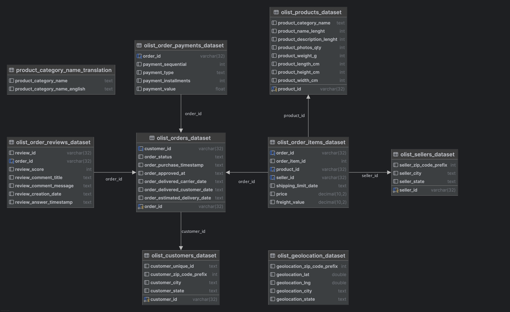
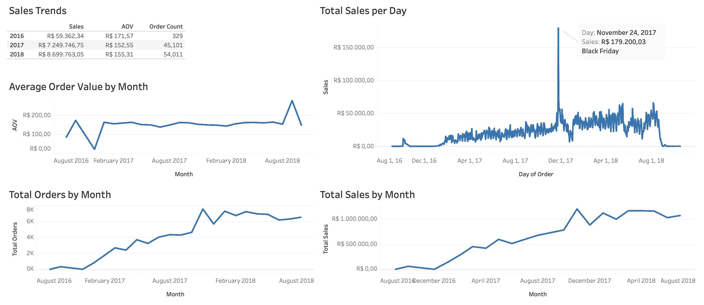

# Olist Analysis

## Project Description
Olist, a Brazilian e-commerce store that sells a wide range of products. The goal is to create a dashboard that enables users to analyze sales performance and impact of different promotions.
The dataset used in this project contains over 100k rows of from 2016 to 2018, but it's important to note that the initial and filan month shows very low sales activity. The currency used in data is The Brazilian real (R$)

## Data
You can find sql schema file with data [here](https://www.kaggle.com)

## Analysis
### Sales trends
- Olist averages R$8 milion in annual sales with 50 000 orders per year
- Sales and orders surged from mid-2017, with Black Friday 2017 driving record sales.
- AOV remains stable (R$ 150–170) with minor variations.

