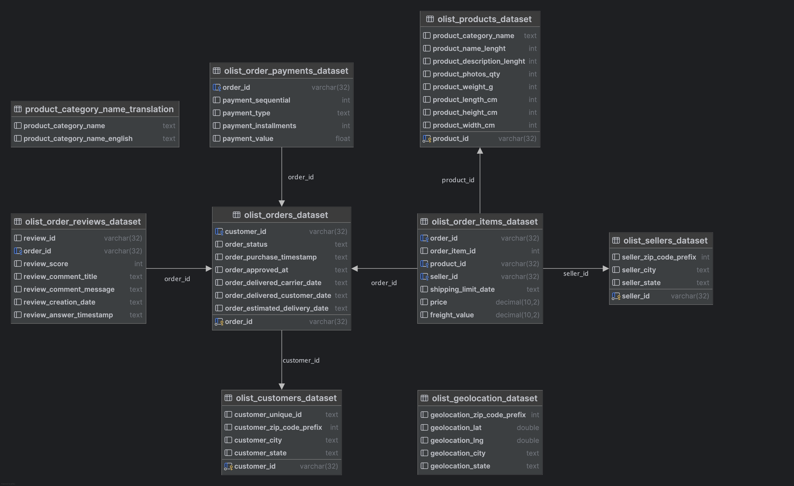

# Olist Analysis

## Project Description
Olist, a Brazilian e-commerce store that sells a wide range of products. The goal is to create a dashboard that enables users to analyze sales performance and impact of different promotions.

## Data
You can find sql schema with data [here](https://www.kaggle.com)

